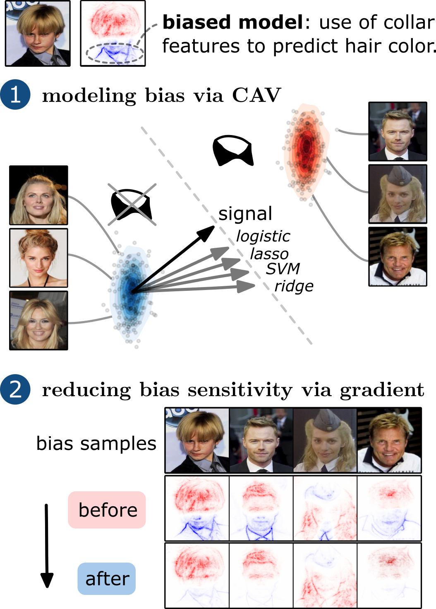
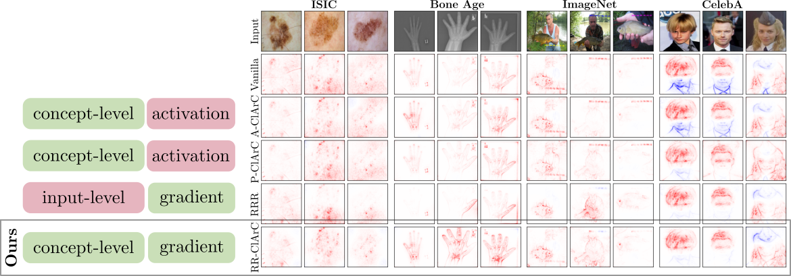

<div align="center">
<h1>From Hope to Safety: Unlearning Biases of Deep Models via Gradient Penalization in Latent Space</h1>
<p>
PyTorch Implementation</p>
</div>

## Description

This repository contains the code for the paper "**From Hope to Safety: Unlearning Biases of Deep Models via Gradient Penalization in Latent Space**".

### Abstract

Deep Neural Networks are prone to learning spurious correlations embedded in the training data, leading to potentially biased predictions. This poses risks when deploying these models for high-stake decision-making, such as in medical applications. Current methods for posthoc model correction either require input-level annotations which are only possible for spatially localized biases, or augment the latent feature space, thereby *hoping* to enforce the right reasons. We present a novel method for model correction on the concept level that *explicitly* reduces model sensitivity towards biases via gradient penalization. When modeling biases via Concept Activation Vectors, we highlight the importance of choosing robust directions, as traditional regression-based approaches such as Support Vector Machines tend to result in diverging directions. We effectively mitigate biases in controlled and real-world settings on the ISIC,
Bone Age, ImageNet and CelebA datasets using VGG,
ResNet and EfficientNet architectures.

<div align="center">
  
</div>

## Table of Contents

- [From Hope to Safety: Unlearning Biases of Deep Models via Gradient Penalization in Latent Space](#from-hope-to-safety-unlearning-biases-of-deep-models-via-gradient-penalization-in-latent-space)
  - [Description](#description)
  - [Table of Contents](#table-of-contents)
  - [Installation](#installation)
  - [Model Training (optional)](#model-training-optional)
    - [Config Files](#config-files)
    - [Training](#training)
  - [Model Correction - Config Files](#model-correction-config-files)
  - [Preprocessing](#preprocessing)
  - [CAV Type Evaluations](#cav-type-evaluations)
    - [CAV Localizations](#cav-localizations)
    - [CAV Alignment](#cav-alignment)
  - [Model Correction](#model-correction)
  - [Evaluation](#evaluation)

[//]: # (## Visuals)

## Installation

We use Python 3.8.10. To install the required packages, run:

```bash 
pip install -r requirements.txt
```

Secondly, the datasets need to be downloaded. To do so, download and extract the ISIC 2019 dataset using the following:

```bash
mkdir datasets
cd datasets
wget https://isic-challenge-data.s3.amazonaws.com/2019/ISIC_2019_Training_Input.zip
wget https://isic-challenge-data.s3.amazonaws.com/2019/ISIC_2019_Training_GroundTruth.zip
unzip ISIC_2019_Training_Input.zip
unzip ISIC_2019_Training_GroundTruth.zip
```

Then, we need to download the Bone Age Estimation dataset. To do so, run:

```bash
wget https://s3.amazonaws.com/east1.public.rsna.org/AI/2017/Bone+Age+Training+Set.zip
wget https://s3.amazonaws.com/east1.public.rsna.org/AI/2017/Bone+Age+Training+Set+Annotations.zip
unzip Bone+Age+Training+Set.zip
unzip Bone+Age+Training+Set+Annotations.zip
cd ..
```

Further, we need to download the CelebA dataset. To do so, visit
the CelebA
website (https://mmlab.ie.cuhk.edu.hk/projects/CelebA.html) and download the 'aligned and cropped' version of the
dataset.

Lastly, we need to download the ImageNet dataset. To do so, visit
the [ImageNet website](https://image-net.org/download.php) and download the training and validation images.

## Model Training (optional)


**NOTE**: We provide model checkpoints! Checkpoints can be downloaded from [here](https://drive.google.com/drive/folders/1HCku0TIIJf69SS-3XlB99Y6aIJZYuGKJ?usp=sharing). Alternatively, to train models from scratch, please follow the instructions below.

Having installed the required packages and datasets,
we can begin with training the models. To do so convieniently,
we use config files to specify the model, dataset and training parameters.

### Config Files

We can generate config files using the config file generator.
To do so,
specify the config file generator parameters in `config_files/config_generator_training_*.py` (replace `*` with dataset name) and run (here: for ISIC2019):

```bash 
cd config_files
python config_generator_training_isic_attacked.py
cd ..
```

Note: We suggest to use [wandb](https://wandb.ai/) to track the training progress and results.

### Training

Using the previously generated config files, we can train the models.
To do so, run:

```bash
python -m model_training.start_training --config_file "config_files/training/your_config_file.yaml"
```
## Model Correction - Config Files
Similarly as for model training, we generate config files to conveniently specify the model correction paramaters. The config-file generators are located in `config_files/config_generator_correcting*.py` (replace `*` with dataset name) and can be run as follows (here: for ISIC2019):

```bash 
cd config_files
python config_generator_correcting_isic_attacked.py
cd ..
```

## Preprocessing

In order to begin with the experiments, we need to precompute latent activations, which, for instance, will be used for the computation of CAVs. 
A model-correction config file needs to be provided for the specification of model type, layer of interest, dataset, etc.
To do so, run:

```bash
python -m experiments.preprocessing.run_preprocessing --config_file "config_files/YOUR_CONFIG.yaml"
```

## CAV Type Evaluations

### CAV Localizations

We can generate CAV localizations by running:

```bash
python -m experiments.preprocessing.localize_artifacts --config_file "config_files/correcting_isic/YOUR_VGG16_CONFIG.yaml" \
                                                       --layer_name "features.28" \
                                                       --cav_type "cav_type" \
                                                       --artifact  "artifact"
```

In our experiments, we use the following parameters for the VGG-16 model with layer_name "features.28":

ImageNet: artifact: "ch_time" \
ISIC: artifact: "lsb" \
Bone Age: artifact: "white_color" \
CelebA: artifact: "blonde_collar"

**NOTE**: These localizations are also used for CelebA to create input-level
bias localizations for model correction with Right for the Right Reasons (RRR).

### CAV Alignment

For the quantitative CAV alignment experiment, we get results by running:

```bash
# if controlled experiment (ISIC, Bone Age, ImageNet)
python -m experiments.evaluation.measure_quality_cav_attacked --config_file "config_files/YOUR_CLARC_CONFIG.yaml"
```

## Model Correction

Now, we can correct the model bias by running:

```bash
python -m model_training.start_model_correction--config_file "config_files/YOUR_CONFIG.yaml"
```

## Model Evaluation

Finally, we can evaluate the corrected model by running:

```bash
# Compute TCAV score and TCAV sensitivity
python -m experiments.evaluation.measure_tcav --config_file "config_files/YOUR_CONFIG.yaml"

# Compute R_bias (relevance on bias)
# if localized bias (ImageNet, CelebA)
python -m experiments.evaluation.artifact_relevance --config_file "config_files/YOUR_CONFIG.yaml"

# Compute attacked/clean accuracy on train/val/test split
# if controlled experiment (ISIC, Bone Age, ImageNet)
python -m experiments.evaluation.evaluate_by_subset_attacked --config_file "config_files/YOUR_CONFIG.yaml"

# Compute accuracy on subsets of dataset with/without artifact on train/val/test split
# if not controlled experiment (CelebA)
python -m experiments.evaluation.evaluate_by_subset --config_file "config_files/YOUR_CONFIG.yaml"
```

where this measures first the bias sensitivity in latent space via TCAV, and then the bias relevance in input space,
followed by an evaluation of accuracy on the clean and biased datasets.

Lastly, we can render attribution heatmaps after model correction as follows.

```bash
python -m experiments.plots.plot_corrected_model --config_file "config_files/YOUR_CONFIG.yaml"
```

Attribution heatmaps for model correction using the methods Vanilla, A-ClArC, P-ClArC, Right for the right reasons (RRR), and RR-ClArC (ours) for ISIC2019 (*controlled, LSB attack*), Pediatric Bone Age (*controlled, brightness*), ImageNet (*controlled, timestamp*), and CelebA (*real artifact: collar*) are shown below.

<div align="center">
  
</div>